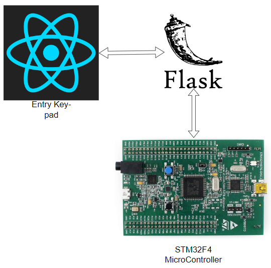

# Entry Code Application

## Behaviour

If correct code is input into web page, Lights will flash in a clockwise pattern, otherwise will flash all 4 lights at once 3 times.

## Design

Device drivers are designed using Interrupts for the USART module
Utilizes custom driver written for the GPIO Module

## Hardware Required

- STM32F407 Discovery Board

- Choice of USART Connection: Female-Female Jumper Wires OR USB-TTL Serial Adapter with TX RX pin compatibility

## Hardware Setup

- Connect choice of USART connection as shown in STM32F407 Discovery Board User Manual
